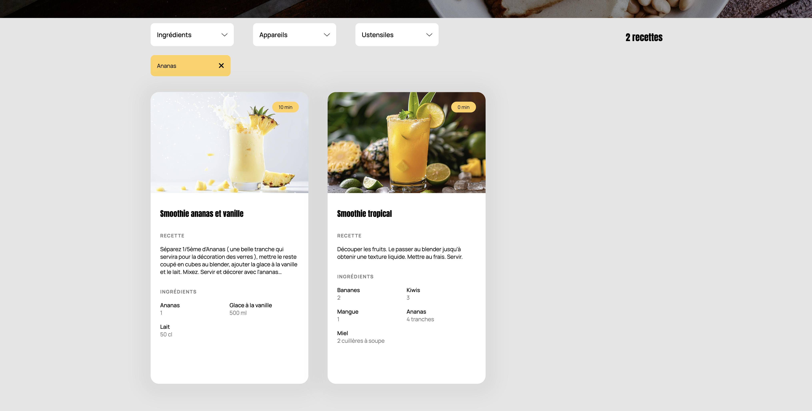

# Les Petits Plats


> <br />
> This project was developed as part of the OpenClassrooms P7 certification.
> <br /><br />

<br />

Recipe search application developed in **vanilla JavaScript**.  
Les Petits Plats allows users to search through a large dataset of recipes using a **main search bar combined with dynamic filters** (ingredients, appliances, utensils).

The core objective of this project is to **design and compare two different search algorithms**, evaluate their performance, and select the most efficient solution.

## Tech stack

<div style="width:100%;">
<table style="width:100%;">
  <tr>
    <th colspan="3" style="text-align:center;">Frontend</th>
  </tr>
  <tr>
    <td align="center">
      <br/>JavaScript ES6+
    </td>
    <td align="center">
      <br/>HTML5
    </td>
    <td align="center">
      <br/>CSS3
    </td>
  </tr>
  <tr>
    <th colspan="3" style="text-align:center;"><br>Constraints</th>
  </tr>
  <tr>
    <td align="center">No framework</td>
    <td align="center">No external libraries</td>
    <td align="center">Pure JavaScript</td>
  </tr>
</table>
</div>

## Installation

Clone the project :

```bash
git clone https://github.com/aalexandree-g/P7LesPetitsPlats.git
```

And open index.html using a local server


## Features Overview

### Main Search Engine

- Global search input filtering recipes by : name, ingredients, description

- Case-insensitive search

- Minimum character threshold before triggering search

- Real-time filtering without page reload

### Advanced Tag Filters

- Dynamic dropdown filters: ingredients, appliances, utensils

- Tag selection and removal

- Combined filtering logic (AND conditions)

- Automatic update of available filter values

### Algorithm Comparison

- Two different search implementations : loop-based approach, optimized functional approach

- Performance comparison based on : algorithmic complexity analysis, execution time evaluation

- Final solution selected based on efficiency and scalability

### Performance & Optimization

- Reduced unnecessary iterations

- Early exits in search loops

- Optimized data structures

- Clear separation between data processing and DOM rendering

- No external libraries used for search logic

## 📸 Screenshots

### Home search


### Tags

